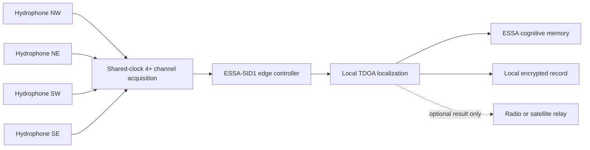

# Hasky Labs ESSA-SID1

## Substrate Intelligent Device 1

**Revision:** 0.1 research prototype  
**Owner:** Hasky Labs  
**Status:** software validated; physical design not yet electrically or field validated

## Purpose

ESSA-SID1 localizes an authorized signal inside its native physical medium. The
first reference configuration uses four cabled hydrophones and a shared sampling
clock. Position is computed locally. Satellite, cellular, or long-range radio is
an optional relay and is never required to calculate the position.

## Design decision

Revision 0.1 uses a cabled star array rather than four independent wireless
underwater nodes. Radio does not propagate through water reliably, and separate
clocks would introduce synchronization error. One simultaneous multichannel
recorder gives every channel the same sampling clock and is the simplest way to
test the localization principle.

## Reference array

- Four sensor coordinates define a 100 m by 100 m test area.
- Every sensor uses the same medium and modality during one localization solve.
- A source must provide an identifiable acoustic signature. Revision 0.1 assumes
  an authorized research tag; it does not claim individual identification from
  untagged ambient movement.
- The propagation speed is configured, measured, and versioned with each survey.
- At least three valid detections are required; four provide redundancy and
  stronger geometry.

## Timing and accuracy budget

At a nominal water sound speed of 1,500 m/s, one meter of path length corresponds
to about 0.667 ms. A 192 kHz common sample clock has a 5.21 microsecond sample
period, but sample rate is not field accuracy. Multipath, sensor coordinates,
clock behavior, tag waveform, temperature, salinity, and solver calibration will
dominate the real error budget. Hasky Labs must publish measured error rather
than infer accuracy from sampling rate.

## Electrical architecture

### Revision A: development system

1. Four hydrophones feed four simultaneous recorder inputs.
2. The recorder supplies a shared conversion clock and writes synchronized
   channels or exposes them through USB.
3. The edge computer extracts one arrival timestamp per sensor and source event.
4. The SID-1 controller rejects unknown sensors, duplicate channels, mixed media,
   and detections from different source signatures.
5. The local solver searches bounded coordinates and minimizes timing residual.
6. A relay packet is generated only when relay is explicitly enabled.

### Revision B: low-power custom hardware

1. Replace the field recorder with a four-channel simultaneous ADC and protected
   low-noise analog front end.
2. Add a low-power controller, hardware watchdog, signed firmware, and calibrated
   power telemetry.
3. Convert detected events to sparse spikes for a supported neuromorphic device.
4. Keep raw high-rate audio local; transmit event timestamps and compact results.

The candidate ADS127L14 is not a finished acquisition board. It requires clock,
reference, power, analog filtering, PCB layout, firmware, EMC, thermal, and
waterproof-system engineering.

## Power architecture

The 20 W goal applies to a future measured field configuration, not the current
development BOM. The official Raspberry Pi 5 supply recommendation can exceed
that goal by itself under maximum provisioning. Revision A prioritizes verified
signals and timing. Revision B must measure average, peak, sleep, sensing, and
compute power before any 20 W claim.

## Mechanical architecture

- Sensor mounts need known, stable coordinates and recoverable anchor lines.
- All submerged connectors, splices, and cable jackets need the intended depth,
  salinity, abrasion, and deployment-duration rating.
- The edge enclosure remains above water for Revision A.
- Use 316 stainless fasteners and isolate dissimilar metals where practical.
- Include strain relief before every electrical termination.

## Software architecture

- `essa/substrate_intelligence.py`: localization and relay boundary.
- `essa/sid1_io.py`: validated JSON configuration and detection CSV ingestion.
- `examples/sid1_field_controller.py`: command-line edge controller.
- `hardware/sid1/config/water-array.json`: versioned deployment geometry.
- `hardware/sid1/sample/detections.csv`: deterministic acceptance data.

## Acceptance gates

1. Unit tests and deterministic dataset pass.
2. Four-channel bench playback recovers known delay differences.
3. Controlled tank testing reports median, 95th percentile, and worst-case error.
4. Clock drift and sensor-coordinate uncertainty are measured.
5. Power is measured at the battery under idle, sensing, and localization loads.
6. Field work proceeds only after electrical, waterproofing, wildlife ethics,
   land/water access, and recovery plans are approved by qualified people.

## Reference component sources

- Aquarian H2a-XLR manual: https://www.aquarianaudio.com/AqAudDocs/H2a_XLR_manual.pdf
- Zoom F6 product: https://zoomcorp.com/en/us/field-recorders/field-recorders/f6/
- Raspberry Pi power guidance: https://www.raspberrypi.com/documentation/computers/getting-started.html
- TI ADS127L14: https://www.ti.com/product/ADS127L14
