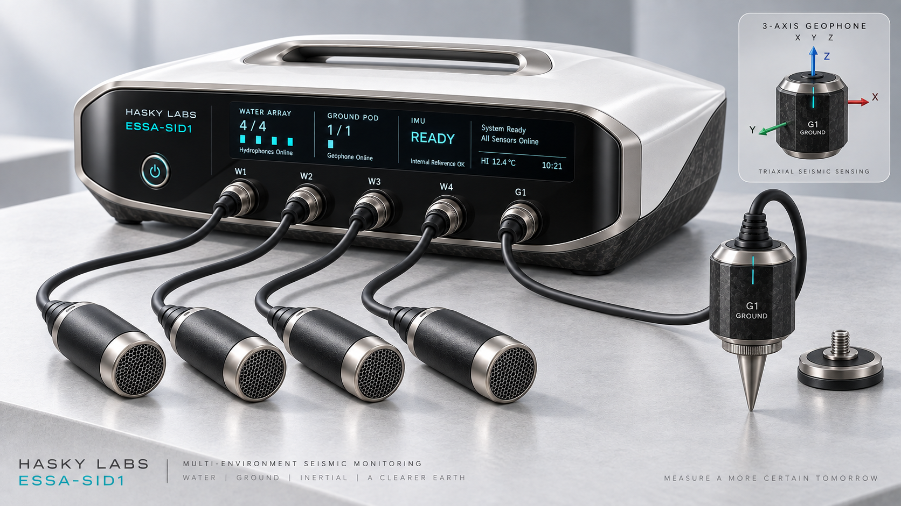

# ESSA-SID1 Hardware Package

This directory contains Hasky Labs' Revision 0.1 design inputs for the ESSA
Substrate Intelligent Device 1.



The image is an AI-generated industrial-design concept, not a photograph of
manufactured or field-certified hardware. It illustrates the future multimodal
product family: four water hydrophones (`W1`-`W4`), one ground-coupled three-axis
geophone (`G1`), and an inertial reference inside the base station. SID1-A
remains the smaller four-hydrophone controlled-water experiment described in
the build plan.

- `DESIGN.md`: system, electrical, mechanical, power, software, and validation design.
- `SID1_A_BUILD_PLAN.md`: agreed purchasing, assembly, controlled-water test,
  acceptance evidence, and stop conditions for the first physical prototype.
- `SENSOR_PODS.md`: boundaries and provisional requirements for the water,
  ground, and inertial sensing domains shown in the concept.
- `MATERIALS.csv`: phased bill of materials with minimum specifications and selection status.
- `SOCIAL_POSTS.md`: technically honest introductory copy for X and Nostr.
- `config/water-array.json`: reference sensor geometry and solver configuration.
- `sample/detections.csv`: synchronized acceptance-test detections.

Run the reference controller from the repository root:

```bash
python3 -m examples.sid1_field_controller \
  --config hardware/sid1/config/water-array.json \
  --detections hardware/sid1/sample/detections.csv
```

No PCB, waterproof enclosure, field accuracy, or 20 W electrical result has yet
been validated. Do not purchase all materials or deploy around wildlife until a
qualified electrical engineer and relevant field specialists review Revision A.
